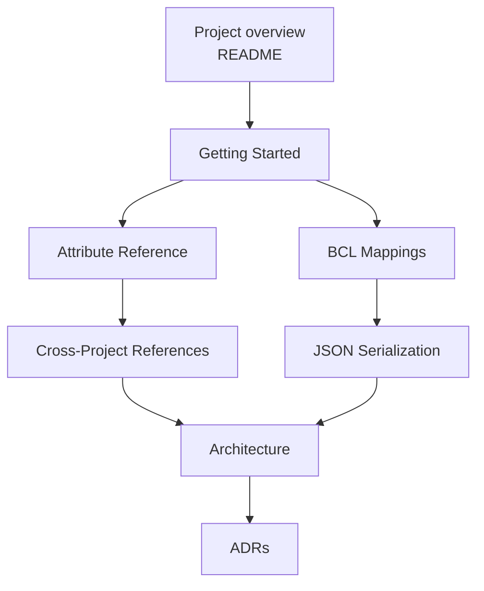
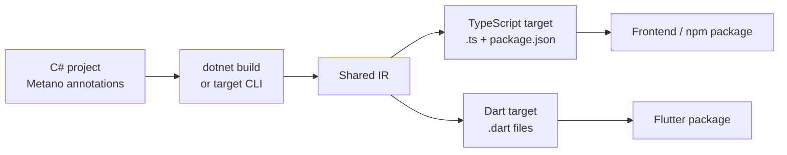

# Metano Documentation

Metano turns annotated C# projects into generated target packages. TypeScript is
the primary supported backend today; Dart/Flutter is experimental and exercises
the same shared IR. This documentation is organized from product usage to
compiler internals, so you can start small and only dive deeper when you need to
shape the output or extend the compiler.

## Recommended Path

## User Guides

| Guide | Read when you want to |
|---|---|
| [Getting Started](getting-started.md) | Create a first C# source project, configure `Metano.Build`, and consume the generated TypeScript package. |
| [Attribute Reference](attributes.md) | Choose the right annotation for selection, naming, output shape, module emission, imports, guards, and target-specific TypeScript behavior. |
| [BCL Type Mappings](bcl-mappings.md) | Understand how primitives, collections, temporal values, `decimal`, `Guid`, LINQ, async, strings, and math are emitted. The current reference is TypeScript-focused. |
| [Cross-Project References](cross-package.md) | Share generated types across multiple C# assemblies and npm packages. |
| [JSON Serialization](serialization.md) | Generate TypeScript serializer metadata from `JsonSerializerContext`. |
| [Comparison](comparison.md) | Decide whether Metano fits better than Blazor, Bridge.NET-style tools, OpenAPI generators, or Fable for your use case. |

## Contributor Guides

| Guide | Read when you want to |
|---|---|
| [Architecture Overview](architecture.md) | Understand the Roslyn frontend, shared IR, TypeScript/Dart bridges, printers, package writers, and test strategy. |
| [Architecture Decision Records](adr/) | See why major design choices were made and what constraints they preserve. |
| [Better Flutter Support Plan](better_flutter_support_plan.md) | Track the experimental Dart/Flutter backend and its remaining gaps. |

## At A Glance

## External Links

- [Main README](../README.md) — concise product overview and quickstart.
- [Sample projects](../samples/) — runnable examples with generated output in
  [targets/js](../targets/js/).
- [Flutter sample target](../targets/flutter/sample_counter/) — Flutter app
  consuming Dart generated from the counter sample.
- [Repository issues](https://github.com/danfma/metano/issues) — backlog and
  roadmap.
