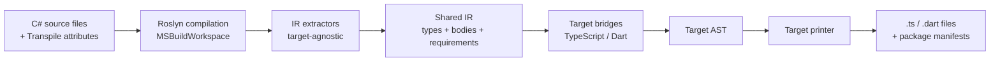

# Architecture Overview

This document explains how Metano is organized internally — the compilation
pipeline, the core projects, the extension points, and where to find things
when you want to contribute.

## High-level pipeline



**Each step:**

1. **Load** — `MSBuildWorkspace` opens the `.csproj`, runs source generators,
   produces a Roslyn `Compilation`.
2. **Discover** — The active `ITranspilerTarget` walks the compilation for
   types marked with `[Transpile]` (or all public types if
   `[assembly: TranspileAssembly]` is set) and groups them by output file.
3. **Extract to IR** — Extractors in `Metano.Compiler/Extraction/` convert
   Roslyn symbols and syntax into the **shared intermediate representation**
   (`Metano.Compiler/IR/`). This layer owns every semantic decision — record
   detection, nullable handling, overload folding, BCL mapping origins,
   runtime helper requirements — and never mentions a specific target.
4. **Bridge to target AST** — Each target project (`Metano.Compiler.TypeScript`,
   `Metano.Compiler.Dart`) consumes the IR through its `Bridge/` namespace,
   producing the target-specific AST: TS records (`TsClass`, `TsFunction`, …)
   or Dart records (`DartClass`, `DartFunction`, …).
5. **Print** — The target printer turns its AST into formatted source text.
6. **Emit manifests + imports** — The target drives `package.json` / `pubspec`
   updates, runtime-helper imports derived from `IrRuntimeRequirement`s, and
   cross-package import resolution via `IrTypeOrigin`.

## Solution layout

```
src/
├── Metano/                            ← Attributes + BCL runtime mappings
│   ├── Annotations/                   ← [Transpile], [Name], [StringEnum], etc.
│   └── Runtime/                       ← Declarative [MapMethod]/[MapProperty]
├── Metano.Compiler/                   ← Target-agnostic core
│   ├── IR/                            ← Shared IR: types, members, bodies,
│   │                                    runtime requirements, diagnostics
│   ├── Extraction/                    ← Roslyn → IR (class, method, expression,
│   │                                    statement, runtime requirement scanner)
│   ├── ITranspilerTarget.cs
│   ├── TranspilerHost.cs
│   ├── SymbolHelper.cs
│   ├── RoslynTypeQueries.cs           ← Shared `IsDictionaryLike()` etc. helpers
│   └── Diagnostics/                   ← MS0001–MS0008
├── Metano.Compiler.TypeScript/        ← TypeScript target
│   ├── Bridge/                        ← IR → TS AST (class emitter, enum,
│   │                                    interface, module, record synthesis,
│   │                                    overload / ctor dispatcher, BCL mapper)
│   ├── Transformation/                ← Discovery + per-file grouping + CLI glue
│   ├── TypeScript/                    ← TS AST (~65 records) + Printer
│   ├── TypeScriptTarget.cs            ← Implements ITranspilerTarget
│   ├── Commands.cs                    ← `metano-typescript` CLI
│   └── PackageJsonWriter.cs
├── Metano.Compiler.Dart/              ← Dart/Flutter target
│   ├── Bridge/                        ← IR → Dart AST (class, enum, interface,
│   │                                    module, type mapper, naming policy)
│   ├── Transformation/                ← Discovery + file grouping
│   ├── Dart/                          ← Dart AST + Printer + IrBodyPrinter
│   ├── DartTarget.cs                  ← Implements ITranspilerTarget
│   └── Commands.cs                    ← `metano-dart` CLI
└── Metano.Build/                      ← MSBuild .targets file
```

## The four-project split

Metano is split into four `.NET` assemblies with strict dependencies:

### `Metano` (assembly / NuGet: `Metano`)

The **attributes** (`[Transpile]`, `[Name]`, `[StringEnum]`, `[EmitPackage]`,
`[PlainObject]`, `[InlineWrapper]`, `[NoEmit]`, `[ModuleEntryPoint]`,
`[ExportVarFromBody]`, `[GenerateGuard]`, …) and the **declarative BCL
runtime mappings** (`[MapMethod]`, `[MapProperty]` assembly-level attributes
that define how `List<T>.Add` → `push`, etc.).

This is the **only** assembly your user code depends on — everything else is
build-time tooling.

- Target: `net8.0;net9.0;net10.0` (multi-targeted)
- No dependencies beyond the netstandard BCL
- Shipped as NuGet package `Metano`

### `Metano.Compiler` (assembly / NuGet: `Metano.Compiler`)

**Target-agnostic** transpiler core. Contains the shared IR, the Roslyn →
IR extractors, the transpiler host, and the diagnostic system. Every target
depends on this project and nothing else for the semantic lowering layer.

Key contents:

- `IR/` — modules, type declarations, members, expressions, statements, type
  references, runtime requirements, diagnostics
- `Extraction/` — `IrClassExtractor`, `IrMethodExtractor`, `IrConstructorExtractor`,
  `IrPropertyExtractor`, `IrExpressionExtractor`, `IrStatementExtractor`,
  `IrRuntimeRequirementScanner`, `IrTypeRefMapper`, `IrAttributeExtractor`
- `ITranspilerTarget` — the interface every language target implements
- `TranspilerHost` — orchestrates load → compile → target.Transform → write
- `SymbolHelper`, `RoslynTypeQueries` — Roslyn helpers shared across targets
- `MetanoDiagnostic` — diagnostic system with codes `MS0001`–`MS0008`

Adding a Kotlin or Swift target means a new project that implements
`ITranspilerTarget` and depends on `Metano.Compiler` — no changes to the core.

- Target: `net10.0`
- Depends on: `Metano`, `Microsoft.CodeAnalysis.CSharp.Workspaces`,
  `Microsoft.CodeAnalysis.Workspaces.MSBuild`
- Shipped as NuGet package `Metano.Compiler`

### `Metano.Compiler.TypeScript` (assembly / NuGet: `Metano.Compiler.TypeScript`)

The **TypeScript target**. Implements `ITranspilerTarget`, holds the TS AST
(~65 record types), the Printer, the IR → TS bridges, and the CLI
(`metano-typescript`, built with ConsoleAppFramework).

- Target: `net10.0`, `OutputType=Exe`, `PackAsTool=true`
- Depends on: `Metano.Compiler`
- Shipped as NuGet package `Metano.Compiler.TypeScript` (installable as a
  dotnet tool: `dotnet tool install -g Metano.Compiler.TypeScript`)

### `Metano.Compiler.Dart` (assembly / NuGet: `Metano.Compiler.Dart`)

The **Dart / Flutter target**. Same shape as the TypeScript target: its own
Dart AST, printer, IR → Dart bridges, and `metano-dart` CLI. Shares zero
semantic lowering with the TypeScript target — both consume the IR and map
it to idiomatic code for their language.

- Target: `net10.0`, `OutputType=Exe`, `PackAsTool=true`
- Depends on: `Metano.Compiler`
- Shipped as NuGet package `Metano.Compiler.Dart`

### `Metano.Build` (assembly / NuGet: `Metano.Build`)

A tiny MSBuild integration package. Contains no code — just a `.targets` file
that hooks into the consumer's `dotnet build` and invokes `metano-typescript`.

- Target: `netstandard2.0` (for maximum NuGet compatibility)
- No dependencies
- Shipped as NuGet package `Metano.Build`

## The shared IR

`src/Metano.Compiler/IR/` is the heart of the architecture. It captures
C# semantics in target-agnostic records — **no naming policy, no emit flags,
no target-specific paths** — so every backend can consume the same lowering.

Highlights:

- **Modules and types.** `IrModule`, `IrClassDeclaration`, `IrInterfaceDeclaration`,
  `IrEnumDeclaration` with semantic annotations (`IrTypeSemantics`,
  `IrNamedTypeSemantics`, `IrMethodSemantics`, `IrPropertySemantics`).
- **Members.** `IrFieldDeclaration`, `IrPropertyDeclaration`, `IrMethodDeclaration`
  (overloads folded onto a primary via the `Overloads` slot),
  `IrEventDeclaration`, `IrConstructorDeclaration` (with
  `IrConstructorParameter.Promotion` for record-style promotion).
- **Type references.** `IrPrimitiveTypeRef` (semantic names like `Guid` —
  never `UUID`), `IrNamedTypeRef` (with optional `IrTypeOrigin` for
  cross-package resolution and `IrNamedTypeSemantics` with the type's kind,
  string-enum values, inline-wrapper primitive, transpilable flag),
  `IrNullableTypeRef`, `IrArrayTypeRef`, `IrMapTypeRef`, `IrSetTypeRef`,
  `IrTupleTypeRef`, `IrFunctionTypeRef`, `IrPromiseTypeRef`,
  `IrGeneratorTypeRef`, `IrIterableTypeRef`, `IrKeyValuePairTypeRef`,
  `IrGroupingTypeRef`, `IrTypeParameterRef`, `IrUnknownTypeRef`.
- **Bodies.** `IrExpression` (literals, identifiers, member / element access,
  invocation, new, binary / unary, conditional, lambda, string
  interpolation, await / throw / cast, is-pattern, switch-expression, list /
  positional / relational / logical / property patterns) + `IrStatement`
  (block, return, local decl, if, switch, throw, foreach, while, do-while,
  try / catch / finally, break, continue, yield-break).
- **Cross-cutting facts.** `IrRuntimeRequirement` (`{helper → category}` —
  e.g., `("HashCode", Hashing)`, `("Temporal", Temporal)`) scanned from any
  declaration. Each backend maps these to concrete imports.
- **Diagnostics.** `IrUnsupportedExpression` / `IrUnsupportedStatement`
  surface shapes the extractor hasn't modeled yet; backends report them as
  `MS0001` warnings instead of silently dropping output.

The **anti-target-shaped checklist** is applied at every IR addition:
semantic names (not target names), no import paths, no naming policy, no
emit flags, semantic annotations (not syntax). Phase 7 (the Dart target)
has been the primary forcing function — every time the IR had a TS bias,
the Dart bridge surfaced it.

## TypeScript target internals

`src/Metano.Compiler.TypeScript/` is split between:

- **`Bridge/`** — IR → TS AST helpers. No Roslyn symbols reach this layer
  (other than a handful of orchestration-only discovery paths).
- **`Transformation/`** — `TypeTransformer` (top-level orchestrator),
  `JsonSerializerContextTransformer` (scoped target-specific), per-file
  grouping, external-import registration, cross-package type discovery.
- **`TypeScript/`** — the TS AST records and the Printer.

### Bridges

Each shape has a dedicated IR → TS lowering, named consistently:

- **`IrToTsClassEmitter`** — the class / record / struct orchestrator. Walks
  `IrClassDeclaration.Members`, defers operators and methods so layout
  matches the canonical "operators before methods" ordering, and forwards
  each shape to the appropriate bridge helper.
- **`IrToTsClassBridge`** — member / constructor / operator / overload
  dispatcher helpers: `BuildField`, `BuildProperty`, `BuildMethod`,
  `BuildEvent`, `BuildOperator`, `BuildOperatorDispatcher`,
  `BuildSimpleConstructor`, `BuildPromotedCtorParams`, `BuildCapturedCtorParams`.
- **`IrToTsEnumBridge`** — numeric + `[StringEnum]` enums.
- **`IrToTsInterfaceBridge`** — C# `interface` → TS `interface`.
- **`IrToTsPlainObjectBridge`** — `[PlainObject]` records → TS interface
  without a class wrapper.
- **`IrToTsInlineWrapperBridge`** — `[InlineWrapper]` structs → branded
  primitive types.
- **`IrToTsExceptionBridge`** — anything inheriting `System.Exception` →
  `class extends Error`.
- **`IrToTsModuleBridge`** — `[ExportedAsModule]` static classes + top-level
  statements → flat top-level functions.
- **`IrToTsRecordSynthesisBridge`** — synthesizes `equals` / `hashCode` /
  `with` for records that aren't `[PlainObject]`.
- **`IrToTsConstructorDispatcherBridge`** / **`IrToTsOverloadDispatcherBridge`** —
  multi-arity dispatchers with runtime type guards via `IrTypeCheckBuilder`.
- **`IrToTsBclMapper`** — consumes the `DeclarativeMappingRegistry` (built
  from `[MapMethod]` / `[MapProperty]` assembly attributes) and renders
  lowered call / member-access expressions.
- **`IrToTsTypeMapper`** — IR type ref → TS type, with an optional
  `IrToTsTypeOverrides` hook for `[ExportFromBcl]` mappings (decimal →
  Decimal from `decimal.js`, etc.).
- **`IrRuntimeRequirementToTsImport`** — `{helper → category}` facts → one
  `TsImport` per module (metano-runtime, @js-temporal/polyfill, …).
- **`IrToTsNamingPolicy`** — TS-specific naming: camelCase, reserved-word
  escaping, `[Name(TypeScript, …)]` resolution.

### `TypeScriptTransformContext`

`Transformation/TypeScriptTransformContext.cs` carries the per-compilation
mutable state every bridge and builder consumes — the cross-assembly type
map, the external import map, the BCL export map, the declarative mapping
registry, and lazily-initialized `BclOverrides` / `OriginResolver`
properties so a single `BclExportTypeOverrides` and a single
`IrTypeOriginResolver` instance serve the whole compilation.

## Dart target internals

`src/Metano.Compiler.Dart/` mirrors the TypeScript target's shape:

- **`Bridge/`** — `IrToDartClassBridge`, `IrToDartEnumBridge`,
  `IrToDartInterfaceBridge`, `IrToDartModuleBridge`, `IrToDartTypeMapper`,
  `IrToDartNamingPolicy`.
- **`Transformation/`** — `DartTransformer` orchestrates discovery and
  file grouping; skips types flagged with `[NoEmit(Dart)]`.
- **`Dart/`** — Dart AST records and `IrBodyPrinter`, which renders IR
  expression / statement trees directly as Dart source (native switch-
  pattern arms, object patterns, `==` / `hashCode` / `copyWith` record
  synthesis via `Object.hash`).

The covered IR subset matches the TypeScript side for types, members,
constructors, and the core expression / statement surface. Gaps (classic
extension methods, `[ModuleEntryPoint]` bodies, the JSON serializer
context) are tracked as follow-ups.

## The TS AST

`src/Metano.Compiler.TypeScript/TypeScript/AST/` contains ~65 record types
that model the TypeScript output:

- **Top level**: `TsSourceFile`, `TsClass`, `TsInterface`, `TsEnum`,
  `TsFunction`, `TsTypeAlias`, `TsImport`, `TsReExport`,
  `TsNamespaceDeclaration`, `TsTopLevelStatement`, `TsModuleExport`.
- **Class members**: `TsFieldMember`, `TsGetterMember`, `TsSetterMember`,
  `TsMethodMember`, `TsConstructor`.
- **Expressions**: `TsIdentifier`, `TsCallExpression`, `TsNewExpression`,
  `TsPropertyAccess`, `TsElementAccess`, `TsBinaryExpression`,
  `TsUnaryExpression`, `TsConditionalExpression`, `TsArrowFunction`,
  `TsObjectLiteral`, `TsArrayLiteral`, `TsStringLiteral`, `TsLiteral`,
  `TsTemplateLiteral`, `TsCastExpression`, `TsTypeReference`,
  `TsTemplate` (for `[Emit]` expansion).
- **Statements**: `TsReturnStatement`, `TsIfStatement`, `TsSwitchStatement`,
  `TsExpressionStatement`, `TsVariableDeclaration`, `TsThrowStatement`,
  `TsYieldStatement`, `TsRawStatement` (escape hatch for loop / try
  lowerings printed verbatim with preserved indentation).
- **Types**: `TsNamedType`, `TsStringType`, `TsNumberType`,
  `TsBooleanType`, `TsArrayType`, `TsUnionType`, `TsTupleType`,
  `TsPromiseType`, `TsVoidType`, `TsAnyType`, `TsBigIntType`,
  `TsStringLiteralType`.

### `TsTypeOrigin` — cross-package imports

`TsNamedType` carries an optional `TsTypeOrigin(PackageName, SubPath, IsDefault)`.
`IrTypeOriginResolver` stamps the origin on every `IrNamedTypeRef` that
resolves to a referenced assembly with `[EmitPackage]`; the TS bridge
propagates it onto `TsNamedType` and `ImportCollector` emits the
cross-package import directly without string-based name resolution.

## The Printer

`src/Metano.Compiler.TypeScript/TypeScript/Printer.cs` — takes a
`TsSourceFile` and produces formatted TypeScript source. Uses an
`IndentedStringBuilder` internally, groups class members in idiomatic order
(fields → constructor → getters/setters → methods), and handles every AST
node type via a switch. Multi-line `TsRawStatement`s are re-indented line
by line so loop / try / catch lowerings keep the active indentation.

## Cyclic reference detection

`CyclicReferenceDetector` runs after all source files are produced. It
builds a directed graph of `importer → imported` edges using the generated
`TsImport` statements, then runs an iterative DFS with a
`currentlyVisiting` stack to detect back-edges. Each distinct cycle is
reported once as an `MS0005` warning.

The detector recognizes:

- `#` (root barrel import)
- `#/foo/bar` (subpath barrel import)
- `./foo` (relative file import, resolved against the importer's directory)

External imports (`metano-runtime`, `@js-temporal/polyfill`, etc.) are skipped.

## `PackageJsonWriter`

`src/Metano.Compiler.TypeScript/PackageJsonWriter.cs` — generates (or
merges) the `package.json` for the output directory. Reads cross-package
dependencies from `TypeMappingContext.UsedCrossPackages` (populated as
`BclExportTypeOverrides` + `IrTypeOriginResolver` resolve BCL and
cross-package references), preserves user-written fields (name, scripts,
dev deps) on re-runs, and emits `imports` and `exports` entries aligned
with the generated file layout.

## Testing

The `Metano.Tests` project uses **TUnit** on Microsoft.Testing.Platform
and runs in ~1.5 s thanks to a process-wide metadata-reference cache
(`TranspileHelper.BaseReferences`). Tests are layered:

1. **Roslyn → IR** — `tests/Metano.Tests/IR/Ir*ExtractionTests.cs` compile
   a C# snippet, run the extractor, and assert on the IR shape. No backend
   dependency.
2. **IR → target AST** — `IrToTsBridgeGoldenTests`, `IrToTsBodyBridgeTests`,
   `IrToTsOverloadDispatcherBridgeTests`, analogous Dart golden tests. Print
   the target output from a hand-built IR (or IR produced by the Roslyn
   path) and compare against expected strings.
3. **End-to-end** — `TranspileHelper.Transpile(csharpSource)` compiles C#
   inline, runs the transformer, and returns `filename → TS content`.
   Cross-package flows use
   `TranspileHelper.TranspileWithLibrary(libSource, consumerSource)`.
4. **Bun suites** — each generated sample under `targets/js/*` has its own
   `bun test` suite (18 + 19 + 51 + …) that validates runtime behavior.

The `Expected/` directory holds golden files for TS output comparison.

## Where to add new features

| Feature type | Where |
|---|---|
| New attribute | `src/Metano/Annotations/` + handle it in the relevant extractor or bridge |
| New BCL type mapping (declarative) | `src/Metano/Runtime/` with `[MapMethod]`/`[MapProperty]` |
| New BCL type mapping (extractor rewrite) | `IrExpressionExtractor` (numeric normalization, etc.) |
| New C# construct semantics | Extend the IR (`Metano.Compiler/IR/`) + the matching extractor |
| New TS lowering shape | New bridge in `Metano.Compiler.TypeScript/Bridge/` |
| New TS AST node | New record in `TypeScript/AST/` + handle in `Printer.cs` |
| New Dart lowering shape | New bridge in `Metano.Compiler.Dart/Bridge/` |
| New language target (Kotlin, Swift, …) | New project implementing `ITranspilerTarget` under `src/` |

## See also

- [CLAUDE.md](../CLAUDE.md) — day-to-day contributor guidance
- [spec/](../spec/) — normative product specification (requirements, attributes, diagnostics, feature matrix)
- [Architecture Decision Records](adr/) — the "why" behind major design choices, including the core/target split, handler decomposition, namespace-first imports, and more
- [GitHub issues](https://github.com/danfma/metano/issues) — feature backlog and in-flight work
- [Attribute Reference](attributes.md) — user-facing view of every attribute
