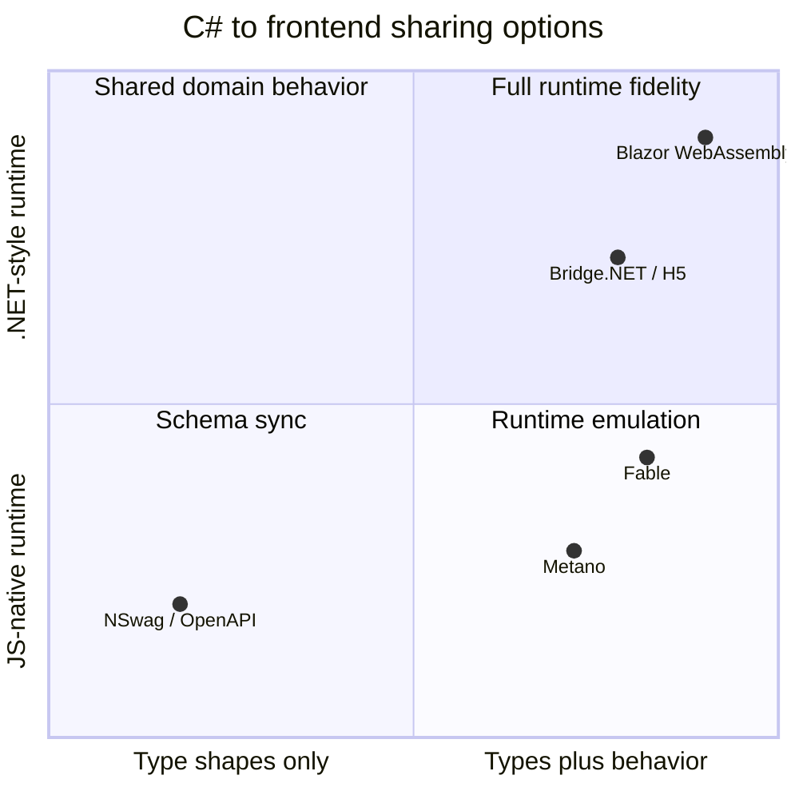

# Comparison

Metano sits between API schema generators and full ".NET in the browser"
runtimes. It is designed for shared domain code: the part of a product where
types and small behavior drift when C# and target-language code are maintained
by hand. The mature backend is TypeScript; the Dart/Flutter backend is
experimental and proves the shared IR can serve more than one target.

## Where Metano Fits

## Compared To OpenAPI Generators

Tools such as NSwag and Swagger Codegen are great when your boundary is an HTTP
contract. They generate request and response shapes from OpenAPI, usually as
TypeScript interfaces or client stubs.

Metano is different because it starts from C# source and emits behavior too:
records, methods, computed properties, LINQ expressions, guards, operators, and
serializer metadata. Use OpenAPI generation for API contracts; use Metano when
the frontend needs the same domain model and rules as the backend.

## Compared To Blazor WebAssembly

Blazor WebAssembly runs .NET itself in the browser. That gives high C# fidelity,
but the app lives inside a .NET/WASM runtime and pays for that runtime at
download and interop time.

Metano emits normal TypeScript files. Your frontend stays a normal JS app, and
only small helper packages are imported when needed. It does not try to run all
.NET code in the browser; it deliberately targets code that can lower cleanly to
the JS ecosystem.

## Compared To Bridge.NET / H5 / SharpKit-Style Tools

Bridge-style tools historically aimed to make broad C# code run on JavaScript by
shipping large compatibility layers and preserving many .NET idioms.

Metano takes a narrower path: explicit opt-in, target-aware output, and a small
runtime. The goal is not "C# pretending to be JavaScript"; it is TypeScript that
looks and behaves like it belongs in a modern frontend package.

## Compared To Fable

Fable is the closest spiritual neighbor: a mature, idiomatic F# to JavaScript
compiler that embraces the JS ecosystem.

Metano applies a similar philosophy to C#, the mainstream language for many
.NET backend teams. It is younger and more constrained, but aims for the same
kind of clean output and ecosystem fit.

## Design Bets

- Share behavior, not only data shapes.
- Keep C# as the source of truth while preserving a native frontend workflow.
- Prefer explicit annotations over surprising whole-program transpilation.
- Restrict unsupported C# features instead of generating heavy or unnatural
  JavaScript.
- Make package boundaries first-class with `[EmitPackage]` and generated
  imports.

## When Not To Use Metano

- You need to run arbitrary .NET libraries in the browser.
- You only need generated HTTP client types from an API contract.
- Your C# code depends heavily on reflection, dynamic dispatch, unsafe code, or
  runtime-only .NET APIs.
- You need full production coverage for a target that is still marked as
  evolving, such as the Dart/Flutter target.
